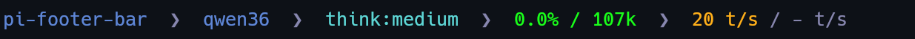

# pi-footer-bar

An independent fork of [pi-bar](https://github.com/tianrendong/pi-bar) showing extra metrics and status info in pi's footer.



## Differences to original pi-bar

removed:

- **`progress` segment** — AI-generated live progress updates (this reduced filesize by ~75%)
- **`extensions` segment** — Extension status text from `ctx.ui.setStatus()`

added/changed:

- **`directory` segment** — CWD display (truncated basename, `~` for home)
- **`tokens` segment** — Live t/s rate (instant + session average)
- **gradient color rendering** - context and t/s values uses a gradient color rendering

## Install

Copy `pi-bar.ts` to your [extension directory](https://github.com/earendil-works/pi/blob/main/packages/coding-agent/docs/extensions.md#extension-locations)
or install with `pi install npm:pi-footer-bar`

## Customization

pi-bar works out of the box. Run `/bar` inside pi to choose which footer segments are shown:

```text
/bar
```
